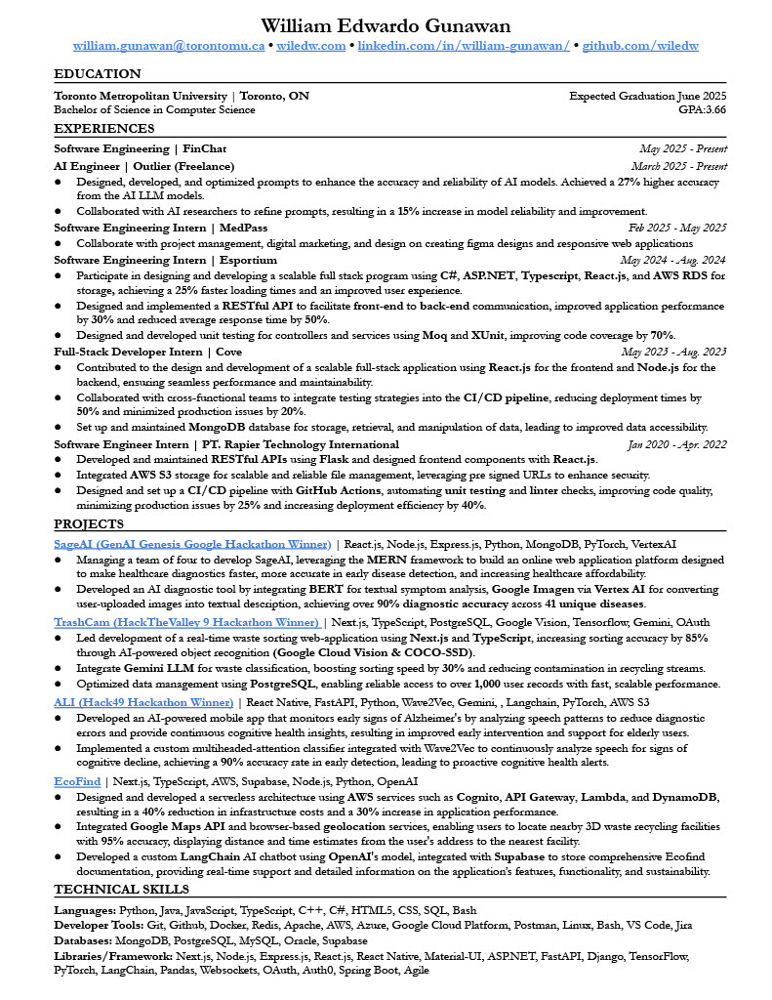

<h1 align="center">Hi 👋, I'm William</h1>
<h3 align="center">I like building random things with code!</h3>

  <a href="https://wiledw.github.io/portfolio/" target="_blank">🌐 Visit my Portfolio</a>

---

### 🛠 Programming Languages
Python • TypeScript • JavaScript • Java

### 🧰 Technologies and Tools
Git • AWS • Docker • Node.js • Express.js • React.js • Next.js • Flask • Spring • ASP.NET • MongoDB • PostgreSQL • Supabase • Oracle • Jira

---

### 📫 How to reach me
**Email**: william.gunawan@torontomu.ca  
**LinkedIn**: [William Edwardo Gunawan](https://www.linkedin.com/in/william-edwardo-gunawan/)

---

### 📄 My Resume

  

